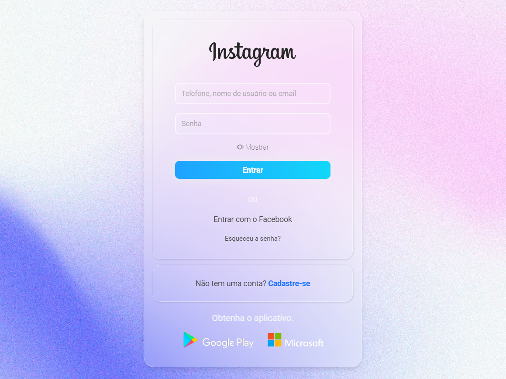

## 🏋️‍♂️ Projeto HTML + CSS + Javascript.

Desafio de projeto proposto para criação de uma nova tela de login do instagram web. 

Os temas abordados são: 
- Responsividade.
- Estilização com CSS.
- Funções com EventListener. 

## Funcionalidades:

- Exibição e ocultação de senha.

## Estrutura do Projeto:

- **index.html:** Arquivo HTML principal.
- **assets/**
  - **css/**
    - **styles.css:** Arquivo CSS para estilização.
  - **js/**
    - **script.js:** Arquivo responsável pela função de exibição de senha.

## 💻 Tecnologias utilizadas nesse projeto:

  
  
  

## 💻 Preview:
- Veja como ficou o projeto acessando: [Link]()
  

